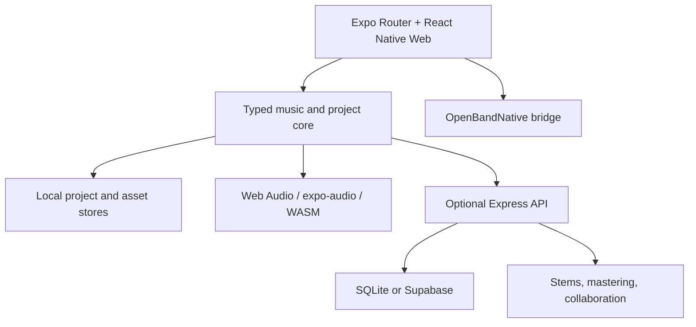

# OpenBand

**Make music. Keep the project.**

A local-first, open-source browser music studio for recording, arranging, mixing, and exporting without mandatory signup.

[](https://github.com/az1nn/openband/actions/workflows/ci.yml)
[](LICENSE)
[](https://openband-one.vercel.app)

[Try the web alpha](https://openband-one.vercel.app) · [Understand the product](docs/product.md) · [See the roadmap](ROADMAP.md) · [Contribute](CONTRIBUTING.md)

> **Alpha:** explore without an account, but keep an independent backup of important work. Platform availability and service-backed features vary by release and configuration.
>
> **Naming note:** OpenBand is the repository's working name while same-category brand clearance is completed. See the [brand gate](docs/marketing/brand.md#naming-gate).


*Current alpha capture; the launch-grade recapture is specified in [`docs/marketing/launch-assets.md`](docs/marketing/launch-assets.md).*

## Why OpenBand

Music ideas often get stranded between a recorder, a beat tool, a DAW, stem services, mastering tools, and closed clouds. OpenBand organizes the journey as **start → hear → shape → finish → keep or share**.

- **Start with momentum:** enter as a visitor or choose a genre and mood starter.
- **Shape in context:** work with audio, MIDI, instruments, guitar tools, effects, stems, and focused creative modes.
- **Finish the track:** mix, meter, master, save, and export without changing products.
- **Keep the project:** use local workflows, inspect the source, and opt into cloud or BYOK AI services only where configured.

Open source is the proof. Creative control is the benefit.

## Product paths

| Path | What it helps you do | Representative tools |
| --- | --- | --- |
| Start | Move past a blank project | Visitor mode, genre/mood starters, samples |
| Record and arrange | Capture and structure musical material | Multitrack audio, MIDI, piano roll, looper, chord track |
| Create sound | Build a part around the instrument or idea | Sampler, synth, beatmaker, guitar pedalboard, amp/cab chain |
| Transform | Prepare or reuse existing material | Stem separation, tuning, time/pitch tools, BYOK helpers |
| Mix and finish | Turn a sketch into a keepable result | Mixer, effects, buses, snapshots, LUFS, mastering, export |
| Explore | Enter focused or experimental workflows | Creative modes and 3D studio rooms |
| Collaborate | Build on shared project foundations | Presence, CRDT, branching, optional services; public flow still evolving |

Detailed, code-backed capability status lives in [`docs/features-implementation.md`](docs/features-implementation.md). Public claims follow the [marketing claim guardrails](docs/marketing/messaging.md#claim-guardrails).

## Current availability

| Surface | Status | How to use it |
| --- | --- | --- |
| Web | Public alpha | [Open the demo](https://openband-one.vercel.app) |
| Electron desktop | Build from source | `npm run desktop` |
| Android | Codebase target / local build | `npm run android` |
| iOS | Codebase target / macOS local build | `npm run ios` |
| Hosted collaboration and AI processing | Configuration-dependent | Run the optional backend services |

No mobile store listing or signed desktop download is claimed by this repository until a verified release link is published.

## Run locally

### Requirements

- Node.js 22 or newer
- npm
- Python 3.12 only if you want local Demucs stem separation

### Web app

```bash
git clone https://github.com/az1nn/openband.git
cd openband
npm ci
npm run web
```

The frontend can run without a `.env` file using development fallbacks. Those fallbacks are for exploration and testing—not proof of production services.

### Optional API

```bash
cd backend
npm ci
npm run dev
```

The API uses SQLite by default for local development. See [`docs/sqlite.md`](docs/sqlite.md) and [`docs/supabase.md`](docs/supabase.md) for storage modes.

### Optional local stem separation

```bash
cd backend
python3 -m venv .venv
source .venv/bin/activate
pip install demucs==4.0.1
npm run dev
```

Without Demucs, development may use mock WAV generation. Do not present mock results as processed audio.

### Desktop

```bash
cd electron
npm ci
cd ..
npm run desktop
```

Desktop-specific I/O crosses the `OpenBandNative` bridge; frontend screens do not call Electron APIs directly.

## Architecture at a glance



| Layer | Main technology |
| --- | --- |
| App | Expo Router, React, React Native Web, TypeScript |
| Styling | NativeWind / Tailwind tokens |
| State | React state/context and Zustand where appropriate |
| Audio | Web Audio, `expo-audio`, worklets, optional WASM |
| Local data | Browser stores / bridge filesystem; SQLite for local API development |
| Hosted data | Optional Supabase/PostgreSQL and object storage |
| Desktop | Electron behind a swappable bridge |
| Validation | TypeScript, Vitest, Playwright smoke tests, architecture graph checks |

Start with [`docs/architecture.md`](docs/architecture.md) for current boundaries and [`docs/graph-engineering.md`](docs/graph-engineering.md) for dependency/impact tooling.

## Useful commands

```bash
npm run lint             # Frontend TypeScript check
npm test                 # Vitest suite
npm run test:legacy      # Legacy node:test suite
npm run test:graph-sdd   # Spec Kit / graph regression tests
npm run graph:ci         # Architecture graph gate
npm run build            # Production web export
```

Backend typecheck:

```bash
cd backend
npm ci
npx tsc --noEmit
```

CI is the source of truth for the complete merge gate. A locally skipped or masked command is not a pass.

## Documentation

| Topic | Document |
| --- | --- |
| Product strategy and honest claims | [`docs/product.md`](docs/product.md) |
| Architecture | [`docs/architecture.md`](docs/architecture.md) |
| Build and runtime setup | [`BUILD.md`](BUILD.md) |
| Feature implementation status | [`docs/features-implementation.md`](docs/features-implementation.md) |
| Product roadmap | [`ROADMAP.md`](ROADMAP.md) |
| Contracts | [`docs/contracts/`](docs/contracts/README.md) |
| Architecture decisions | [`docs/adr/`](docs/adr/README.md) |
| Marketing foundation | [`docs/marketing/`](docs/marketing/README.md) |
| Screenshot/UI audit | [`marketing/SCREEN-SPECS.md`](marketing/SCREEN-SPECS.md) |

## Contributing

OpenBand welcomes focused issues, reproducible bugs, documentation improvements, audio-engineering evidence, and well-scoped pull requests.

Read [`CONTRIBUTING.md`](CONTRIBUTING.md) before changing the project. Repository work is PR-first and uses GitHub Spec Kit for T2+ changes; [`AGENTS.md`](AGENTS.md) defines the agent policy.

## License

The repository currently carries the terms in [`LICENSE`](LICENSE). Project attribution and third-party notices are a documented launch-review item; dependencies, models, samples, and creator-provided material retain their own terms.
