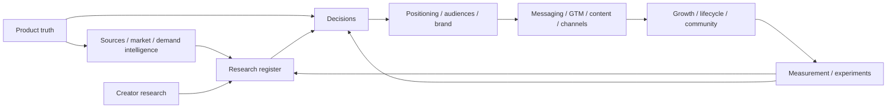

# OpenBand Marketing Foundation

> Status: strategic marketing baseline for the pre-launch Web MVP. `OpenBand` is the repository/product working name until brand-name clearance is complete.

## Purpose

This directory is the marketing source of truth for OpenBand. It translates product truth into a traceable system of **research → decisions → positioning → execution → measurement → learning**.

It is intentionally narrower than the full technical feature inventory. Marketing must sell what a new user can trust today, not everything the repository can theoretically do.

## Launch truth

The current launch contract is defined by GitHub Issue #46 and its launch slices (#47–#51):

- public Web MVP first; Android follows after native hardening;
- a visitor can start a local project without mandatory signup;
- core creation remains free;
- local-first ownership is central to the value proposition;
- first sound target: under 60 seconds;
- blank project → valid exported song target: under 10 minutes;
- save/reopen and export must be trustworthy before broad launch;
- social feed, CRDT collaboration, stems, AI cover generation, advanced AutoMix, video export, MCU, DAWproject, and advanced mastering are not launch blockers.

Marketing copy must not imply that every implemented feature is launch-grade until its user journey is proven.

## Strategic thesis

OpenBand should not try to win by having the longest DAW feature checklist. That is a losing comparison against mature incumbents.

The wedge is:

> **A local-first, open-source music studio that lets a musician start creating immediately, keep control of the project, and export a real song without account lock-in.**

The product experience has to prove that claim in minutes.

## Marketing principles

1. **Creation before registration.** The first CTA is to make sound, not create an account.
2. **Ownership before cloud dependency.** Local-first is a product benefit, not an anti-cloud ideology.
3. **Proof before parity.** Demonstrate reliable workflows; do not market inventory as equivalent to mature competitors.
4. **Musician language before engineering language.** CRDT, WebAudio, Supabase, Spec Kit, and architecture graphs are credibility content for technical audiences, not the hero message.
5. **Open source as trust and agency.** Inspectability, portability, contribution, and long-term resilience are stronger than "free code" alone.
6. **No competitor distortion.** Never imply another DAW is universally paid, closed in every workflow, or incapable of features it demonstrably supports.
7. **No AI slop positioning.** AI is an optional accelerator. The brand is music creation and ownership, not "AI music".
8. **Privacy claims must match implementation.** Do not claim "nothing leaves your device" if a user invokes cloud collaboration, stem separation, hosted services, or external AI providers.
9. **No fake market precision.** Platform users, recorded-music revenue and creator-economy statistics are context/proxies until OpenBand measures its own addressable behavior.
10. **Proof before content volume.** Publish real creator workflows, first-hand education and transparent engineering evidence instead of maintaining a filler calendar or keyword factory.
11. **Scale creator value, not channel vanity.** Views, impressions, rankings, stars, upvotes and clicks are inputs; successful creators and return behavior decide whether a channel scales.
12. **Retention is creative return.** Reopening the app or clicking a message is weaker evidence than returning to meaningful creation.
13. **Lifecycle requires permission and value.** Do not convert a local-first product into mandatory CRM identity capture for reminders/referral.
14. **Community utility before community size.** Open surfaces/programs only when they help creators/contributors and the project can steward them well.

## P0 risks before public brand investment

### 1. Name collision

As of 2026-09-11, an unrelated product named **OpenBand** is already listed in Google Play and Apple's App Store in the same music/collaboration category. It markets collaborative recording, mixing, stem separation, AI tools, social features, and publishing.

This creates severe search, app-store, social-handle, word-of-mouth, and potential legal-confusion risk.

**Rule:** treat `OpenBand` as a working name until a naming clearance gate evaluates app stores, domains, social handles, GitHub, trademarks, and category confusion. Do not commission expensive identity work or buy media against the name before that gate.

### 2. License presentation

The repository `LICENSE` currently carries the Expo/650 Industries copyright text. Before using "open source" as a flagship trust claim, review project ownership/attribution and third-party notices so the repository communicates licensing accurately. Do not blindly remove third-party notices.

### 3. Feature-claim mismatch

The README exposes a very broad feature inventory while the launch issues explicitly narrow the public MVP to the core creative loop. Public-facing copy should use launch-gated proof points and move the full inventory to a technical/features reference.

## Knowledge architecture

The marketing system has five layers. Each layer answers a different question and should not silently take ownership of another layer's job.

| Layer | Question | Canonical artifacts |
| --- | --- | --- |
| Product truth | What can the product honestly promise now? | `../product.md`, feature status, launch issues/specs |
| Evidence & intelligence | What do we know, observe, assume, or still need to test about users, market, demand and platforms? | [`research-register.md`](./research-register.md), [`source-registry.md`](./source-registry.md), [`market-intelligence.md`](./market-intelligence.md), [`demand-intelligence.md`](./demand-intelligence.md), [`competitive-landscape.md`](./competitive-landscape.md), [`pricing-landscape.md`](./pricing-landscape.md), [`creator-research.md`](./creator-research.md) |
| Decisions | What durable choices constrain marketing? | [`decision-log.md`](./decision-log.md) |
| Strategy & execution | Who, why, what message, which channels, what launch/content/growth/community motion? | positioning, audiences, messaging, brand, GTM, content system, channel playbooks, growth OS, lifecycle, community, launch kit/assets |
| Learning | Did the strategy create creator value and what changes next? | [`measurement.md`](./measurement.md), [`experiments.md`](./experiments.md) |



## Marketing operating model


## Canonical files

### Evidence and market/demand intelligence

- [`source-registry.md`](./source-registry.md) — dated external sources, source quality, freshness, supported claims and caveats.
- [`research-register.md`](./research-register.md) — hypotheses, observations, evidence state, freshness and next validation.
- [`market-intelligence.md`](./market-intelligence.md) — category structure, market segmentation, geographic signals and disciplined TAM/SAM/SOM model.
- [`demand-intelligence.md`](./demand-intelligence.md) — search intent, creator-demand clusters, opportunity scoring, organic validation and SEO doctrine.
- [`competitive-landscape.md`](./competitive-landscape.md) — strategic competitor map and dated source notes.
- [`pricing-landscape.md`](./pricing-landscape.md) — adjacent monetization/pricing models and OpenBand pricing guardrails.
- [`creator-research.md`](./creator-research.md) — participant model, interview/usability protocol, synthesis taxonomy and research-to-strategy loop.

### Decisions

- [`decision-log.md`](./decision-log.md) — durable strategic decisions, rationale, authority and supersession history.

### Strategy

- [`positioning.md`](./positioning.md) — category, JTBD, differentiation and competitive frame.
- [`audiences.md`](./audiences.md) — IUP/ICP model, persona fit, anti-segments, messaging matrix and future B2B hypotheses.
- [`brand.md`](./brand.md) — brand idea, visual territory, naming gate and identity rules.
- [`messaging.md`](./messaging.md) — message house, copy bank, voice, claims and landing architecture.

### Go-to-market and execution

- [`go-to-market.md`](./go-to-market.md) — launch phases, growth progression and allocation logic.
- [`content-operating-system.md`](./content-operating-system.md) — proof hierarchy, editorial gates, content briefs, asset ladder and measurement rules.
- [`channel-playbooks.md`](./channel-playbooks.md) — channel roles, native proof formats, operating rules, metrics and stop/scale criteria.
- [`growth-operating-system.md`](./growth-operating-system.md) — activation/retention/referral loops, milestone gates and weekly growth operating cadence.
- [`lifecycle-messaging.md`](./lifecycle-messaging.md) — permissioned in-product/release/opt-in lifecycle messaging and reactivation guardrails.
- [`community-operations.md`](./community-operations.md) — support/discussion/contribution surfaces, stewardship, moderation and community-health gates.
- [`launch-checklist.md`](./launch-checklist.md) — marketing/release gates mapped to product launch truth.
- [`launch-kit.md`](./launch-kit.md) — localized, channel-ready copy templates governed by launch gates.
- [`launch-assets.md`](./launch-assets.md) — current visual evidence audit, production brief and rights record.

### Measurement and learning

- [`measurement.md`](./measurement.md) — activation, retention, referral/community health, north-star model, event taxonomy and privacy rules.
- [`experiments.md`](./experiments.md) — experiment backlog, hypotheses, metrics, guardrails, results and knowledge-base feedback loop.

## Knowledge governance

### Evidence labels

Research uses explicit states:

`VERIFIED | OBSERVED | HYPOTHESIS | UNKNOWN | STALE`

Do not convert a hypothesis into a fact by repeating it across documents.

### Decision labels

Durable choices use:

`ACTIVE | PROVISIONAL | SUPERSEDED | RETIRED`

Material strategy changes must update the decision log rather than silently rewriting the old rationale.

### Source discipline

Reusable external evidence should have an `S-*` entry in [`source-registry.md`](./source-registry.md) containing:

- source owner and URL;
- date checked;
- authority/quality grade;
- proposition(s) the source supports;
- caveats / what it does not prove;
- linked `R-*` research items.

This is especially important for market size, pricing, user counts, competitor claims, search/discovery rules and platform policies.

### Freshness

Re-check time-sensitive evidence before it is used externally. This includes:

- competitor positioning/features;
- pricing;
- app-store availability;
- platform support;
- search demand and discovery behavior;
- channel/platform policies;
- naming/domain/social/trademark availability;
- legal or policy-sensitive claims.

Product behavior must be checked against the actual promoted release, not remembered implementation state.

### Market-sizing rule

Do not present a numeric OpenBand TAM/SAM by copying a generic music-software report or a platform user count.

A defensible model should distinguish:

```text
macro music economy
≠ creator-platform population
≠ digital music creators
≠ browser-first addressable creators
≠ OpenBand activated/retained creators
```

Until beta evidence exists, use the operational SOM milestone defined in [`market-intelligence.md`](./market-intelligence.md) rather than invented market-share precision.

### Demand rule

A search/content opportunity is actionable only when:

```text
creator intent
+ product proof
+ relevant activation path
+ current evidence
```

Search volume, platform reach or trendiness alone does not justify publishing. See [`demand-intelligence.md`](./demand-intelligence.md).

### Content rule

A durable content asset should trace back to product/research evidence and forward to one measurable creator action. See [`content-operating-system.md`](./content-operating-system.md).

### Growth rule

Scale only loops that produce successful returning creators without degrading product trust or support health. See [`growth-operating-system.md`](./growth-operating-system.md).

### Lifecycle rule

Local creation must not depend on marketing identity. In-product context and public release notes come before opt-in email/push; permissioned channels remain optional. See [`lifecycle-messaging.md`](./lifecycle-messaging.md).

### Community rule

A new community surface/program requires both a recurring creator/contributor job and stewardship capacity. Activity/member counts alone are not sufficient. See [`community-operations.md`](./community-operations.md).

### Traceability rule

A material campaign/content/lifecycle claim should be traceable backward:

```text
claim / intervention
→ messaging / content / lifecycle / community artifact
→ positioning / audience / decision
→ R-* research item
→ S-* source or product/creator evidence
```

If that path breaks, qualify the claim or do not publish it.

### Learning rule

A completed experiment must not die in a dashboard. It should update:

1. the relevant `R-*` research entry;
2. the relevant `MD-*` decision if the evidence changes strategy;
3. downstream positioning/messaging/GTM/content/growth/community only after the knowledge layer is reconciled.

Creator interviews and usability studies follow the same rule: sanitized synthesis updates the public knowledge layer; raw participant material stays out of the public repository.

## Decision hierarchy

When marketing artifacts disagree, use this order:

1. verified current product behavior;
2. approved Spec Kit feature/launch contract and GitHub issue acceptance criteria;
3. active decisions in [`decision-log.md`](./decision-log.md);
4. current research/evidence state and registered sources;
5. positioning, audience, brand and messaging strategy;
6. GTM/content/channel/growth/community playbooks;
7. campaign copy and channel-specific assets.

A campaign may simplify language, but it must not widen the product promise.
