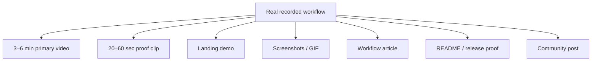

# Content Operating System

> Purpose: convert OpenBand product evidence into a repeatable content engine that acquires qualified creators, improves trust, and feeds learning back into the marketing knowledge base.

## Content principle

OpenBand should publish **proof, not filler**.

Every meaningful asset should do at least one of these jobs:

1. help a creator make music;
2. prove a product promise;
3. explain a meaningful tradeoff;
4. teach something technically useful;
5. preserve community knowledge;
6. produce evidence about audience/channel fit.

If an asset does none of these, it is probably noise.

## Content hierarchy

### Tier 1 — Proof assets

Highest strategic value.

Examples:
- blank project → first sound, uncut;
- riff → tone → record → arrange → export;
- sample → beat → export;
- voice idea → arranged sketch;
- save → close → reopen → export;
- local project / hosted-service boundary demonstration;
- release-specific capability demonstration.

Proof assets should be reusable across landing pages, YouTube, short-form clips, README, launch posts, and creator outreach.

### Tier 2 — Workflow education

Helps users complete a job.

Examples:
- how to record guitar in a browser;
- how to structure a quick demo;
- how to recover/reopen a local project;
- basic arrangement workflow;
- export troubleshooting;
- supported-browser/audio-input guidance.

### Tier 3 — Trust and differentiation

Explains why the system is designed a certain way.

Examples:
- what local-first means in practice;
- what stays local and what can use hosted services;
- why core creation is account-optional;
- how open source changes inspectability and contribution;
- transparent limitations and launch-status notes.

### Tier 4 — Engineering credibility

Targets developer-musicians and contributors.

Examples:
- Web Audio architecture;
- audio-rendering fidelity work;
- cross-platform bridge design;
- Spec Kit + Graph Engineering workflow;
- test strategy;
- performance postmortems;
- difficult bugs with before/after proof.

### Tier 5 — Community output

Compounds creator value after a community exists.

Examples:
- creator project breakdowns;
- presets/templates;
- sample packs with clear rights;
- remix/challenge outcomes;
- contributor spotlights;
- “shipped from this issue” stories.

## Content unit

A strong OpenBand content unit contains:

```text
Audience
+ Job / tension
+ Real input
+ Product transformation
+ Audible/visible output
+ Honest limitation
+ One CTA
+ Measurement tag
```

Example:

```text
Guitarist
+ “I have a riff before I have a song”
+ raw guitar input
+ tone + recording + arrangement
+ exported sketch
+ supported-browser/input caveat
+ Record your riff
+ guitar_workflow cohort
```

## Proof-first narrative structure

Use this sequence for product demos:

1. **Show the input immediately.** Riff, voice, sample, MIDI, blank project.
2. **State the job in one sentence.** No long brand intro.
3. **Perform the workflow.** Prefer actual product motion over explanation.
4. **Show/hear the output.** Close the transformation loop.
5. **State the limitation if material.** Browser support, alpha status, service dependency, etc.
6. **Give one next action.** Start creating, try the workflow, or view source.

## Asset ladder

One strong proof session should produce multiple derivatives without inventing new claims.



Derivative content is good when it preserves the same evidence. It becomes content spam when the same weak idea is rewritten across channels merely for volume.

## Editorial gates

Before publishing, pass these gates.

### Gate A — Product truth

- Is the demonstrated behavior present in the promoted release?
- Is the workflow repeatable?
- Are mocks/dev fallbacks excluded or explicitly labeled?
- Does the output actually work?

### Gate B — Claim integrity

- Does copy stay inside [`messaging.md`](./messaging.md) guardrails?
- Are time-sensitive competitor/pricing claims refreshed?
- Are speed claims measured rather than assumed?
- Are privacy/local/cloud boundaries precise?

### Gate C — Audience usefulness

- Is there one clear audience/job?
- Would this be useful without knowing the OpenBand brand?
- Does it provide original evidence, first-hand experience, or a concrete solution?
- Does it avoid generic “top 10 AI music tools” style commodity content?

### Gate D — Distribution fit

- Is the format native to the channel?
- Is the hook accurate?
- Is there one CTA?
- Can downstream activation be attributed at least coarsely?

### Gate E — Rights

- Do we own or have permission for audio, images, samples, project files, user content, and screenshots?
- Are third-party logos/screenshots used only where appropriate and necessary?
- Are contributor/creator permissions recorded?

## Content brief template

```md
ID: CONT-XXX
Status: IDEA | APPROVED | PRODUCING | PUBLISHED | RETIRED
Audience:
Research link:
Job/tension:
Content tier:
Proof input:
Proof output:
Primary claim:
Evidence source:
Channel:
Format:
Hook:
CTA:
Primary metric:
Guardrail:
Release/version shown:
Rights status:
Published URL:
Result:
Knowledge update:
```

## Content portfolio

Do not let one content type dominate simply because it is easy to produce.

Working mix during beta:
- **40% proof/workflow:** real creation and product demonstrations;
- **20% education:** solve creator jobs and support activation;
- **15% ownership/trust:** local-first, project control, limitations;
- **15% build in public:** engineering credibility and contributor acquisition;
- **10% community:** only when real community output exists.

This is an operating starting point, not a quota. Product reality and measured channel fit override it.

## Content-to-funnel map

| Funnel | Content job | Example | Primary metric |
| --- | --- | --- | --- |
| Discovery | earn qualified attention | riff → track clip | qualified visit |
| Intent | prove the promise | uncut creative loop | Studio open |
| Activation | reduce confusion | first-session workflow | first sound |
| Completion | help finish | save/export guidance | export success |
| Retention | help continue | reopen/templates/workflows | D7 return |
| Advocacy | make sharing useful | creator breakdown/challenge | referral/community action |
| Contribution | expose technical depth | architecture/build log | meaningful contributor action |

## Content measurement

Do not judge content only on platform metrics.

### Platform indicators

Useful but incomplete:
- impressions/reach;
- click-through rate;
- view duration/retention;
- saves/bookmarks;
- comments;
- subscribers/followers.

### Product indicators

Strategically stronger:
- content → Studio open;
- content → first sound;
- content → successful creator;
- content cohort → D7 return;
- content cohort → referral/contribution.

### Learning indicators

Also record:
- repeated words users use to describe the product;
- confusion introduced by the content;
- unexpected audience segments;
- objections/questions worth adding to FAQ or onboarding;
- workflows users request after seeing a proof asset.

## YouTube packaging rule

Current YouTube guidance emphasizes viewer satisfaction, relevance, engagement, quality, and packaging that clearly communicates value. Titles and thumbnails matter; tags are secondary and mainly useful for misspellings. See S-015/S-016.

For OpenBand:
- title the **job or transformation**, not the feature inventory;
- thumbnail should show recognizable input/output or product state;
- the first seconds must deliver the promised workflow quickly;
- optimize for the intended creator, not an abstract algorithm;
- use retention data to improve storytelling, not to justify clickbait.

Bad:
> OpenBand v0.9 New Features Update #17

Better:
> I turned one guitar riff into a full sketch in the browser

## Short-form rule

Short-form exists to demonstrate transformation, not summarize documentation.

Structure:

```text
0–2s: recognizable input / tension
2–8s: product motion
8–20s: transformation
20–35s: audible result / key proof
end: one CTA
```

Do not force every workflow into 20 seconds. If the proof requires context, use long-form.

## Written content rule

A written page should contain at least one substantive reason to exist beyond a video embed or keyword phrase:
- original test;
- exact workflow;
- troubleshooting knowledge;
- product architecture detail;
- measured comparison;
- source-backed market/technical explanation;
- reusable template/checklist.

People-first content and first-hand expertise are aligned with current Google guidance; see S-012/S-014.

## Content maintenance

Every durable asset should declare or imply its maintenance class.

| Class | Re-check trigger |
| --- | --- |
| Evergreen concept | material strategy/product change |
| Product workflow | promoted release changes flow |
| Browser/platform support | support matrix change |
| Competitor comparison | before reuse + at least quarterly |
| Pricing | before reuse + within 30 days |
| Launch claim | every promoted release |
| Technical architecture | architecture/ADR change |

Retire content when fixing it would be more misleading than useful.

## AI-assisted content boundary

AI may help:
- transcribe;
- summarize internal notes;
- generate rough outlines;
- repurpose a verified proof asset;
- check consistency and style.

AI must not:
- invent user quotes;
- manufacture test results;
- synthesize fake product experience;
- create unsupported competitor claims;
- mass-produce thin SEO pages;
- turn implementation intent into shipped behavior.

When automation materially contributes to a content artifact where readers would reasonably care how it was created, disclose the method appropriately.

## Eight-week operating cycle

A sustainable beta cycle:

### Week input
- current product proof;
- top support friction;
- research backlog;
- release notes;
- channel performance;
- creator language.

### Weekly output
- one substantial proof/education/build asset;
- one or two derivatives only if the source asset deserves them;
- one community/research interaction that can produce evidence;
- knowledge-base update when new evidence appears.

### Monthly review
Decide:
- which audience produced successful creators;
- which content type produced downstream value;
- which claims caused confusion;
- what should stop;
- what should be refreshed;
- what product friction prevents content from converting.

## Content stop rules

Stop or reduce a format when:
- it produces reach but consistently poor activation;
- it attracts an audience outside the product's current promise;
- support cost exceeds learning/value;
- the workflow is not reliable enough to demonstrate honestly;
- production burden displaces higher-value product work;
- repeated content does not create new evidence or creator value.
