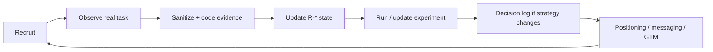

# Creator Research

> Purpose: turn interviews, usability sessions, alpha tests and creator conversations into reusable evidence rather than anecdote.

This file defines the repository structure and research protocol. Individual studies should link back to [`research-register.md`](./research-register.md) and update evidence states after synthesis.

## Research goals

The launch research program should answer five questions:

1. Can a new creator make useful sound quickly?
2. Can they understand, preserve and export the project without coaching?
3. Which creator segment experiences the strongest value?
4. Is local-first ownership meaningful to creators or mainly interesting to the team?
5. What existing workflow does OpenBand replace, complement or fail to fit?

## Research principles

- Observe behavior before explaining product philosophy.
- Ask for the creator's current workflow before pitching OpenBand.
- Prefer real creative tasks over feature-opinion surveys.
- Preserve exact user language when it changes positioning or copy.
- Separate usability failure from positioning failure.
- A small qualitative sample can identify patterns and failure modes; it cannot estimate population percentages.
- Do not recruit only developers, friends or open-source enthusiasts and then generalize to musicians broadly.

## Participant dimensions

Track these dimensions without forcing participants into one rigid persona:

### Primary workflow

- beat/sample-first;
- guitar/instrument-first;
- vocalist/singer-songwriter;
- producer/generalist;
- developer-musician / open-source advocate.

### Experience

- beginner;
- intermediate;
- advanced/professional.

### Current environment

- browser/mobile-first;
- desktop DAW primary;
- mixed tools;
- lightweight recording/sketch tools.

### Existing tools

Record actual tools used rather than selecting only from a predefined competitor list.

### Creation frequency

- less than monthly;
- monthly;
- weekly;
- multiple times per week / professional.

### Collaboration pattern

- solo;
- occasional collaborator;
- regular small team;
- studio/organization.

## Alpha recruitment target

For the first deliberate qualitative wave, recruit **15–40 creators** across workflow entries rather than maximizing raw sample size.

Suggested minimum diversity before drawing cross-persona conclusions:

| Cohort | Suggested minimum |
| --- | ---: |
| Beat/sample-first | 4 |
| Guitar/instrument-first | 4 |
| Vocalist/songwriter | 4 |
| Producer/generalist | 4 |
| OSS/developer-musician | useful overlay, not a replacement for creator cohorts |

Participants can overlap cohorts. Do not claim representativeness from quota completion alone.

## Core first-session task

Give the participant a goal, not a tour:

> **Use OpenBand to turn an idea into something audible, make a meaningful change, preserve it, reopen it, and export something you would keep or share.**

Allow them to choose the starting material where the product supports it:

- record;
- import;
- instrument/MIDI;
- beat/sample;
- guitar/instrument input.

Do not explain local-first before the task unless the participant asks.

## What to measure

### Behavioral

- time to Studio open;
- time to first sound;
- time to first meaningful edit;
- save success/failure;
- reopen success/failure;
- export success/failure;
- total task completion time;
- number and type of blocking failures;
- places where the researcher must intervene.

### Qualitative

- first hesitation;
- strongest positive reaction;
- strongest trust concern;
- what the participant thinks is happening when saving;
- what they believe would happen on another device;
- whether they understand local vs hosted state;
- what current tool/workaround OpenBand reminds them of;
- whether they would use it for a real sketch this week;
- what job they would trust OpenBand with today;
- what would prevent reuse.

## Interview guide

### 1. Current behavior

- Tell me about the last piece of music you started.
- Where did the idea begin?
- What tools did you use from idea to share/export?
- Where did you change tools, and why?
- What usually causes a sketch to remain unfinished?
- How do you know a project is safely saved?

### 2. Unmoderated-first product task

Let the participant attempt the core task with minimal intervention.

### 3. Post-task debrief

- What do you think this product is for?
- Who do you think it is for?
- What felt faster than your current workflow?
- What felt worse or less trustworthy?
- Where do you think the project lives right now?
- If the product disappeared tomorrow, what would you expect to still have?
- Would you use this for a real idea? Which kind?
- What would you still open your current DAW for?

### 4. Ownership probe

Only after their unaided interpretation:

> OpenBand is intentionally local-first for the core project path. Does that matter to you? Why or why not?

Then ask:

- Have you ever lost access to a project because of a service, device or account?
- Do you care more about local control, cross-device convenience, or both?
- When would you willingly move a project to a hosted service?

### 5. Optional paid-service probe

Do not ask generic willingness-to-pay first.

Present concrete future services one at a time:

- sync/backup;
- collaboration;
- managed compute/stems;
- advanced mastering compute;
- team workspace.

Ask what they do today, how often the problem occurs, and what existing cost/time they incur.

## Research record template

Create one record per participant/session in an appropriate private research store if personally identifying information or recordings are involved. Commit only sanitized synthesis to the public repository.

```md
### CR-YYYY-NNN

Date:
Research type: interview | usability | alpha task | survey | support synthesis
Consent / recording status:
Persona/workflow:
Experience:
Current tools:
Creation frequency:
Task:

Behavioral outcomes:
- first sound:
- save:
- reopen:
- export:
- intervention required:

Key observations:
- 

Exact language worth preserving:
- 

Interpretation:
- 

What this does not prove:
- 

Linked research IDs:
- R-XXX

Follow-up:
- 
```

## Synthesis taxonomy

Tag observations with one or more dimensions.

### Activation

- `ACT-FIRST-SOUND`
- `ACT-ONBOARDING`
- `ACT-BLANK-CANVAS`
- `ACT-RECORD`
- `ACT-IMPORT`
- `ACT-INSTRUMENT`

### Trust

- `TRUST-SAVE`
- `TRUST-REOPEN`
- `TRUST-EXPORT`
- `TRUST-LOCAL`
- `TRUST-CLOUD-BOUNDARY`

### Workflow

- `WF-TOOL-SWITCHING`
- `WF-GUITAR`
- `WF-BEAT`
- `WF-VOCAL`
- `WF-MIX`
- `WF-FINISH`

### Positioning

- `POS-SPEED`
- `POS-OWNERSHIP`
- `POS-OPEN-SOURCE`
- `POS-BROWSER`
- `POS-COLLAB`

### Retention

- `RET-REAL-PROJECT`
- `RET-CONTINUE`
- `RET-BLOCKER`
- `RET-CURRENT-DAW`

## Evidence-strength guidance

### One participant

Use for:
- bug/failure discovery;
- vocabulary discovery;
- new hypothesis.

Do not use for:
- segment preference claim;
- percentage;
- strategy reversal by itself.

### Repeated pattern across a cohort

Can support:
- `OBSERVED` research state;
- prioritizing an experiment or usability fix;
- copy-language changes if consistent and low risk.

### Behavior + repeated qualitative evidence + product metrics

Can support:
- stronger strategy decision;
- moving a hypothesis toward `VERIFIED` within a defined scope;
- changing audience/channel priority.

## Planned research waves

### Wave 1 — Core-loop trust

Goal:
- validate first sound → edit → save/reopen → export.

Linked research:
- R-001, R-003, R-011.

### Wave 2 — Positioning comprehension

Goal:
- determine whether speed, ownership, browser access or open source is the strongest unaided perceived difference.

Linked research:
- R-002.

### Wave 3 — Acquisition wedges

Goal:
- compare guitar, beatmaker and songwriter workflows on activated-creator rate and reuse intent.

Linked research:
- R-004, R-005, R-006.

### Wave 4 — Geographic cohort

Goal:
- test Brazilian/LatAm creator acquisition and messaging as a dedicated cohort without assuming geography is the cause of performance.

Linked research:
- R-015.

### Wave 5 — Future monetization / teams

Gate:
- only after core activation and retention are credible.

Goal:
- understand hosted sync, compute and team willingness-to-pay through existing-workaround research.

Linked research:
- R-009, R-016.

## Privacy and repository boundary

Do not commit:
- participant names;
- email addresses;
- raw recordings;
- private music/audio;
- unpublished lyrics;
- private project files;
- precise personal location;
- credentials or account identifiers.

Public documentation should contain only sanitized synthesis and aggregate findings. Raw research belongs in an access-controlled research store with consent and retention rules.

## Research-to-strategy loop



The purpose of creator research is not to accumulate interviews. It is to reduce uncertainty in product and market decisions.
