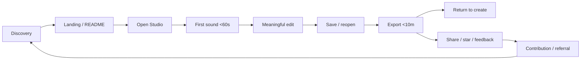

# Go-to-Market

## Objective

The first marketing objective is not scale. It is to prove that a new creator understands the promise, reaches first sound quickly, exports successfully, and believes the ownership model.

The GTM should therefore move through **proof → focused community → public beta → repeatable distribution**.

Audience selection, fit signals, and persona-specific messaging live in [`audiences.md`](./audiences.md).

## Launch sequence

### Phase 0 — Naming and launch truth

Gate before identity spend:
- complete product-name clearance;
- resolve repository license/attribution presentation;
- complete launch-critical persistence/export/first-run gates;
- rewrite public claims around the launch-grade creative loop;
- establish one canonical public URL and one canonical product name.

Exit criteria:
- naming decision documented;
- core promise demonstrably true;
- landing/README claims trace to release evidence.

### Phase 1 — Closed creator alpha

Target 15–40 deliberately selected testers rather than broad traffic.

Recruit from:
- independent musicians/producers who already use browser or lightweight DAWs;
- guitarists/home-recording users;
- developer-musicians and open-source audio users;
- trusted peers willing to screen-record a first session.

Ask them to complete one exact journey:

> Open product → start local project → create first sound → record/import/edit → save/reopen → export → describe where confidence dropped.

Collect:
- time to first sound;
- time to export;
- failure count;
- first point of confusion;
- whether local ownership was understood;
- whether they would use it again for a real sketch;
- one sentence describing the product in their own words.

Do not lead testers with a feature tour before the task.

Exit criteria:
- the core journey is completed repeatedly without facilitator rescue;
- the dominant first-session failure modes are understood;
- creator language converges enough to sharpen acquisition copy;
- the team can distinguish product-quality failures from messaging failures.

### Phase 2 — Public Web beta

Launch package:
- focused landing page;
- user-first README;
- 20–40 second uncut creative-loop demo;
- one longer 3–6 minute real workflow video;
- public launch-status page or section;
- CONTRIBUTING.md + CODE_OF_CONDUCT.md + SECURITY.md where appropriate;
- GitHub Discussions enabled;
- issue templates for bug, feature request, and first-run feedback;
- social preview image;
- tagged beta release and concise changelog.

Public beta CTA hierarchy:
1. **Start creating**
2. **View source**
3. Star / contribute / report feedback

Exit criteria:
- acquisition traffic can enter the studio without explanatory hand-holding;
- the landing → studio → first-sound path is measurable;
- save/reopen/export trust is strong enough for public proof content;
- support and limitation documentation matches the promoted release.

### Phase 3 — Community compounding

Once activation is healthy, build loops around reusable creator value:

- shareable project templates;
- preset/pedal/amp recipes;
- sample packs with clear licensing;
- open challenges using the same starter project;
- contributor spotlights;
- build-in-public changelogs;
- user-created tutorials;
- localization;
- plugin/integration ecosystem when architecture is ready.

The community should create material that helps the next user make music, not only discuss development.

Exit criteria:
- at least one acquisition channel generates repeat visitors rather than launch-only spikes;
- returning creators represent meaningful product usage, not only repository interest;
- community output helps new creators activate;
- support load remains compatible with the size of the project.

### Phase 4 — First 1,000 successful creators

The target is not 1,000 signups. OpenBand should count creators who reach meaningful product value.

Use **successful creator** as the working unit: a unique creator who starts or opens a project, produces sound, makes a meaningful change, and saves or exports.

Focus:
- double down on the best-performing workflow wedge from guitar, beatmaking, songwriting, or general independent production;
- publish repeatable proof content around that workflow;
- improve activation before buying or chasing more traffic;
- build lightweight referral and sharing loops around actual output;
- collect structured reasons for return, abandonment, and recommendation;
- identify whether creator ownership is understood without lengthy explanation.

Do not broaden positioning merely to increase top-of-funnel traffic. A smaller high-fit audience with strong activation is more useful than a large ambiguous audience.

Suggested milestone checks:
- 100 successful creators: qualitative fit and first-session reliability;
- 250 successful creators: channel/message comparison becomes meaningful;
- 500 successful creators: identify the strongest acquisition wedge and retention pattern;
- 1,000 successful creators: decide whether the next constraint is product depth, distribution, retention, or monetizable hosted demand.

Exit criteria:
- one or more repeatable acquisition motions exist;
- activation and completion rates are stable enough to compare cohorts;
- D7 return is measurable and not dominated by developers/testers;
- the leading persona/wedge is supported by behavior, not only survey preference;
- the next product-growth bottleneck is explicit.

### Phase 5 — Repeatable growth

Growth starts only after the product can absorb it.

Possible motions:
- creator-led tutorials and remix/challenge loops;
- SEO pages for proven workflows, not speculative feature keywords;
- creator partnerships around real production tasks;
- integrations that reduce workflow switching;
- templates/presets that shorten time to first useful output;
- contributor ecosystem and technical credibility;
- selective paid acquisition only when activation economics can be measured;
- future hosted collaboration/compute experiments when organizational demand appears.

Growth rule:

> Scale the path that produces successful returning creators, not the channel that produces the most clicks.

## Funnel

The critical marketing conversion is **landing → first sound**, not landing → signup.

## Channel strategy

### 1. GitHub — credibility and contributor acquisition

Role:
- source of truth;
- public roadmap/issues;
- technical proof;
- contributor funnel.

Actions:
- rewrite README opening around value and launch status;
- expand topics to include discovery terms such as `open-source`, `music-production`, `audio`, `web-audio`, `local-first`, `expo`, and `typescript` where accurate;
- enable Discussions;
- create social preview art;
- add contribution/security/community docs;
- use Releases for public milestones rather than only commit history;
- label approachable issues deliberately instead of manufacturing "good first issue" work.

### 2. YouTube — highest-value product proof

Core formats:
- **60-second proof:** blank project → audible beat/recording;
- **5-minute workflow:** idea → export;
- **guitar workflow:** interface → pedal/amp → recording;
- **build log:** one user problem, one engineering change, one before/after;
- **open-source deep dive:** local-first persistence, audio architecture, tests, performance;
- **comparison by workflow:** solve the same job in multiple tools without attack marketing.

Every video should lead to one action: try the Web app or inspect the source.

### 3. Short-form video

Platforms: TikTok, Instagram Reels, YouTube Shorts; only after there is enough real product motion.

Hooks:
- "Can an open-source browser DAW make a track in 60 seconds?"
- "No signup. Start recording."
- "I built a guitar sketch entirely in the browser."
- "What local-first means for a music project."

Avoid feature-list talking heads. Show sound and UI immediately.

### 4. Reddit / specialist communities

Potential communities include music production, home recording, guitar, Linux/open-source audio, self-hosting/local-first, and web-audio/developer groups.

Rules:
- contribute before promoting;
- tailor the post to the community's actual problem;
- share a transparent build/proof story rather than campaign copy;
- disclose creator/project affiliation;
- do not cross-post the same launch text everywhere.

### 5. Hacker News / developer communities

A `Show HN` can work because the story is technically distinctive: local-first browser DAW, audio processing, cross-platform architecture, open-source development.

The post should lead with what was built and what was technically hard, then link to a live demo and source. Do not frame music users as merely a pretext for an engineering demo.

### 6. Product Hunt / launch aggregators

Useful for a concentrated launch event, but secondary to creator activation. Do not launch there before persistence/export reliability is demonstrated; short-lived traffic on a weak core loop produces misleading demand signals.

### 7. Creator partnerships

Start with micro-creators whose audience overlaps the actual workflow:
- bedroom producers;
- guitar/home-recording channels;
- open-source/Linux musicians;
- WebAudio creators;
- music educators after education use is validated.

Offer a real test brief, not a scripted positive review.

## Acquisition wedge experiments

Run small, comparable experiments before declaring a segment primary. Each test should use a real workflow, the same measurement window, and a single CTA.

| Hypothesis | Proof asset | Primary audience | Success signal |
| --- | --- | --- | --- |
| Guitar is the strongest wedge | riff → recorded/arranged track | guitar/home recording | high studio-open + first-sound rate |
| Beatmaking distributes best | sample → beat → export | beatmakers | strong short-form completion + activation |
| Songwriting has strongest emotional pull | voice memo → arranged song | singer-songwriters | high qualified click + return intent |
| Open source creates advocates | architecture/local-first deep dive | developer-musicians | stars/contributions that also produce product usage |

Do not choose the winner by impressions alone. Prefer the wedge that produces successful creators and return behavior.

## Content engine

### Pillar A — Create in minutes

Purpose: acquisition.

Topics:
- first beat in 60 seconds;
- record a guitar idea fast;
- import stems and sketch an arrangement;
- build a chorus from a blank project;
- export the result.

### Pillar B — Own the project

Purpose: differentiation and trust.

Topics:
- local-first explained for musicians;
- what happens when you create without an account;
- how save/reopen works;
- project recovery and portability;
- exactly when cloud services are used.

### Pillar C — Open development

Purpose: developer/contributor acquisition.

Topics:
- architecture walkthroughs;
- WebAudio/DSP lessons;
- Expo cross-platform tradeoffs;
- Spec Kit / engineering graph workflow;
- performance fixes;
- test strategy;
- transparent release retrospectives.

### Pillar D — Sound and instruments

Purpose: musician credibility.

Topics:
- pedal/amp recipes;
- before/after mix processing;
- synth/sample workflows;
- arrangement breakdowns;
- mastering comparison with measured loudness when reliable.

### Pillar E — Community output

Purpose: retention/referral.

Topics:
- creator project of the week;
- open remix challenge;
- contributor release notes;
- community presets/samples;
- "we shipped this because of this issue" stories.

## Content cadence for the first 8 weeks

Do not optimize for volume. A sustainable baseline:

- 1 substantial product/build post per week;
- 1 YouTube workflow/demo every 1–2 weeks;
- 2–3 short clips extracted from real demos per week;
- release/changelog post when user-visible improvements ship;
- community reply/support continuously during beta.

If product quality work consumes the week, skip content rather than publish filler.

## Growth KPI gates

Use [`measurement.md`](./measurement.md) as the event source of truth. GTM decisions should be based on cohorts and successful creation, not vanity totals.

### Acquisition
- qualified landing sessions by channel;
- Start Creating CTR;
- studio-open rate;
- cost per qualified studio open if paid distribution is tested.

### Activation
- first-sound completion rate;
- median time to first sound;
- meaningful-edit rate;
- save/reopen completion;
- valid-export completion;
- median blank-project → valid-export time.

### Retention
- D1 return;
- D7 return;
- project reopened and continued;
- successful creators with multiple sessions.

### Advocacy
- creator shares/referrals;
- GitHub stars that correlate with product usage;
- issues and actionable feedback;
- contributor conversion;
- user-created tutorials, presets, templates, or demos.

### North-star candidate

**Weekly Successful Creators** — unique creators in a week who open/create a project, produce sound, make a meaningful change, and save or export.

Treat this as a candidate until instrumentation and cohort behavior show that it correlates with retention and creator value.

## Experiment discipline

For each marketing experiment record:
- audience hypothesis;
- channel;
- creative/proof asset;
- CTA;
- expected funnel movement;
- measurement window;
- result;
- decision: scale, iterate, stop, or inconclusive.

Do not change audience, hook, CTA, and landing experience at the same time and then claim to know what worked.

## SEO strategy

Because the brand name has collision risk, early organic acquisition should target problem/category intent more than brand intent.

Candidate keyword clusters to validate with search-volume data later:

### Category
- open source DAW
- browser DAW
- online DAW
- web DAW
- free music production software
- open source music production software

### Ownership / workflow
- DAW without account
- local first music app
- offline browser DAW
- own music project files

Use "offline" only for runtimes/workflows proven to operate offline.

### Guitar
- browser guitar amp simulator
- guitar pedalboard software
- record guitar in browser

### Utility / feature
- open source stem separator
- browser MIDI editor
- free online multitrack recorder

A keyword becomes a landing/content target only if the corresponding workflow is reliable enough to satisfy the search intent.

## Landing information architecture

1. Hero: core promise + Start Creating / View Source.
2. Real product demo.
3. Creative loop: Start → Shape → Finish.
4. Local-first ownership.
5. Open-source trust.
6. Launch-grade creative capabilities.
7. Roadmap / what is next.
8. Community/contribution.
9. FAQ: account, storage, browser support, privacy, AI/cloud boundaries, export.

## Repository/community backlog

High priority before beta:
- README restructure;
- canonical product URL;
- repo social preview;
- naming decision reflected everywhere;
- CONTRIBUTING.md;
- CODE_OF_CONDUCT.md;
- SECURITY.md;
- issue templates;
- Discussions;
- public release notes;
- screenshots/video under a stable docs/assets path;
- explicit supported-browser statement;
- privacy/data-ownership explanation;
- license/attribution review.

## Monetization guardrails

The current product contract says **core creation stays free**. Preserve that promise unless deliberately changed through product strategy.

Do not design monetization before activation/retention proof. Later options that can coexist with open source include:
- donations/sponsorship;
- optional hosted sync/collaboration;
- managed compute for expensive processing;
- convenience cloud services;
- commercial support/institutional deployment;
- marketplace economics with clear creator terms.

Never create a paid dependency for opening or exporting a locally owned core project without explicitly changing the product promise.

## Launch narrative

The strongest launch story is:

> Browser DAWs are convenient. Open-source DAWs are inspectable and durable. OpenBand is an experiment in combining those values: open a studio immediately, make something real, and keep control of the project.

The story becomes credible only when the demo proves it.
