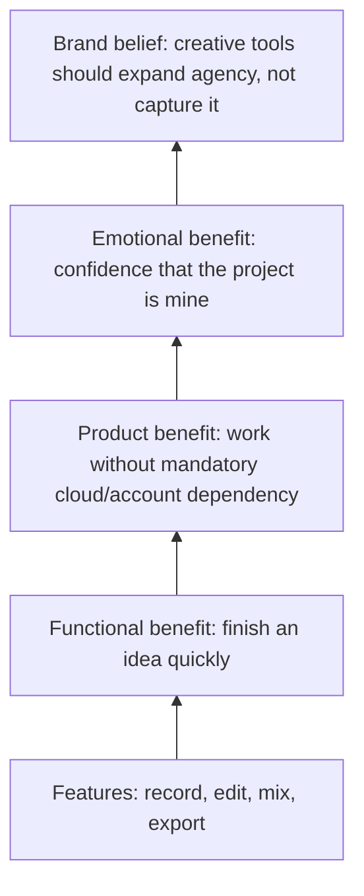

# Positioning

## Category

Primary category:

> **Local-first open-source music studio**

Search/discovery category:

> **Open-source browser DAW / online music production studio**

The category language should help users understand the product immediately. "Music production platform" is accurate but too broad to create a sharp position.

## Positioning statement

For independent musicians, producers, guitarists, and technically curious creators who want to turn an idea into an actual track without giving up control of the project, OpenBand is a local-first, open-source music studio that starts in the browser and gets from a blank project to an export quickly. Unlike cloud-first creation products, OpenBand makes local ownership, inspectability, and a free core part of the product contract rather than an afterthought.

## Market wedge

OpenBand should enter through **low-friction creation + ownership**, not social-network scale or maximal DAW depth.

The initial promise is not:

- the most powerful DAW;
- the biggest musician network;
- the best AI music generator;
- a complete replacement for every desktop DAW;
- feature-for-feature BandLab parity.

The initial promise is:

> **Open the studio. Make sound. Keep the project. Export the song.**

This is concrete, testable, and aligned with the MVP contract.

## Audience priority

### P1 — Independent creators who want a fast browser studio

Profile:
- songwriter, beatmaker, singer, instrumentalist, bedroom producer;
- uses a laptop/desktop browser regularly;
- wants to capture and shape ideas without installation or signup friction;
- is sensitive to paywalls, project lock-in, or cloud dependency.

Primary job:
> "When I have an idea, help me turn it into something I can hear and export before the creative impulse disappears."

Reason to believe:
- visitor mode;
- blank project → first sound target < 60s;
- record/import/edit/mix/export core;
- local-first project ownership.

### P2 — Guitarists and instrument-first musicians

Profile:
- records guitar/bass/vocals at home;
- may use an audio interface;
- wants amp/cab/pedal tools without opening a heavyweight production environment first.

Primary job:
> "Let me plug in, get a usable tone, record the idea, and turn it into a track."

Future content hooks:
- pedalboard;
- amp/cab modeling;
- tuner;
- recording workflows;
- quick mixing/mastering.

### P3 — Open-source / local-first / developer-musicians

Profile:
- values source availability, transparent architecture, self-direction, interoperability, and inspectability;
- may contribute code, docs, presets, samples, translations, testing, or design;
- is disproportionately valuable in the early community even if it is not the largest TAM.

Primary job:
> "Give me a music tool I can inspect, trust, extend, and help improve."

Reason to believe:
- public source;
- MIT-labelled repository, subject to attribution cleanup;
- local-first product architecture;
- transparent issues/specs/roadmap.

### P4 — Educators, students, and community labs

This is a later validation segment, not a launch message. A no-install browser studio with local ownership can be attractive in learning environments, but classroom workflows, admin controls, content policies, accessibility, and deployment constraints must be validated before marketing to institutions.

## Jobs to be done

| Job | Desired outcome | MVP proof |
| --- | --- | --- |
| Capture an idea | first audible result fast | first sound < 60s |
| Record/import material | reliable track creation | recording/import smoke |
| Arrange a song | obvious basic edit flow | move/duplicate/delete/repeat |
| Mix enough to share | audible volume/pan/mute/solo result | playback/export parity |
| Protect work | save/reopen without surprises | persistence trust gate |
| Finish something | valid export | WAV export trust gate |
| Stay in control | no mandatory account for local project | visitor/local-first flow |
| Understand the tool | inspect source and roadmap | public GitHub |

## Core tensions OpenBand resolves

### Fast vs owned
Many lightweight online tools optimize for immediate creation but center account/cloud state. OpenBand can own the intersection: **immediate creation with local ownership as a first-class path**.

### Accessible vs capable
Desktop DAWs can be deep but intimidating. The initial OpenBand experience should expose a simple creative loop while allowing advanced capabilities to exist behind progressive disclosure.

### Open vs polished
Open-source creative tools often win trust but can lose on onboarding and visual polish. OpenBand must make openness visible without using it as an excuse for rough UX.

### AI-assisted vs creator-controlled
AI tools can accelerate repetitive work, but the product should position the musician as the author. BYOK and optional AI reinforce agency if copy remains precise about what leaves the device.

## Differentiation hierarchy

### 1. Local-first ownership
Most important launch differentiator. Must be demonstrated behaviorally, not just stated.

### 2. Open source and inspectability
Credibility, contribution, portability, and long-term trust.

### 3. Low-friction browser entry
No installation required for the Web MVP; visitor mode should lead directly to creation.

### 4. Broad creative surface
Recording, MIDI/instruments, guitar tools, mixing, export, stems, AI and social features become expansion proof after the core loop is reliable.

### 5. Cross-platform direction
Web first; Android, iOS, and Desktop are part of product direction, but launch copy must distinguish supported/release-grade targets from repository capability.

## Positioning ladder

## Competitive frame

OpenBand should avoid direct "X killer" language.

- **BandLab** owns scale, community, cloud convenience, and broad creator tooling. OpenBand should not try to out-social it at launch.
- **Soundtrap** strongly owns online collaboration and approachable browser creation. OpenBand's stronger wedge is open source + local-first ownership.
- **Ardour** owns deep open-source desktop production and engineering-grade routing. OpenBand should not claim comparable mature DAW depth; it can own browser-first accessibility.
- **LMMS** owns free/open-source beat and electronic music creation on desktop. OpenBand can differentiate on browser entry, audio recording workflows, local-first web ownership, and cross-platform direction.
- **Cubasis** owns mature mobile DAW depth and Steinberg ecosystem credibility. OpenBand's counter-position is open/free-core/web-first rather than feature supremacy.

See [`competitive-landscape.md`](./competitive-landscape.md) for evidence and current source notes.

## Anti-positioning

Do not use these as the brand center:

- "BandLab but open source"
- "free Ableton"
- "AI-powered DAW"
- "social network for musicians"
- "professional DAW in your browser"
- "all-in-one music ecosystem"

They either subordinate the brand to competitors, create unverifiable quality expectations, or widen the promise beyond the launch experience.
