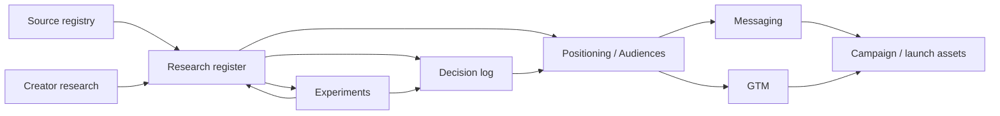

# Marketing Research Register

> Purpose: keep market assumptions, observations, evidence, and validation work traceable. This file is not campaign copy. It is the research ledger behind positioning and go-to-market decisions.

## Evidence states

Use one state per research item:

- `VERIFIED` — supported by current product behavior or a directly checked external source.
- `OBSERVED` — seen in qualitative/market evidence but not yet strong enough to generalize.
- `HYPOTHESIS` — plausible and strategically useful, but still requires testing.
- `UNKNOWN` — material question without enough evidence.
- `STALE` — previously useful evidence that must be refreshed before reuse.

A research item may inform a decision without becoming a public claim. Public claims remain governed by [`messaging.md`](./messaging.md) and the launch gates.

## Freshness policy

- Current product behavior: re-check against the promoted release before launch copy is published.
- Competitor/product claims: re-check before any campaign, comparison page, press pitch, or launch post that depends on them.
- User research: preserve date, sample, task, and method; do not silently generalize from a small sample.
- Search demand, pricing, app-store status, platform support, and legal/name availability are time-sensitive by default.
- External evidence should be registered in [`source-registry.md`](./source-registry.md) when it becomes reusable decision evidence.

## Research ledger

| ID | Question / proposition | State | Current evidence | Next validation | Decision impact |
| --- | --- | --- | --- | --- | --- |
| R-001 | Independent creators value a low-friction path from idea to export. | HYPOTHESIS | Product strategy and audience model are built around this job; no broad user validation yet. | Closed alpha task study with 15–40 creators; measure first sound, export, hesitation and reuse intent. | Primary audience, onboarding, hero copy. |
| R-002 | Local-first ownership is meaningful enough to differentiate OpenBand, not merely technically interesting. | HYPOTHESIS | Competitive review shows a plausible white space; internal product contract makes ownership explicit. | Ask alpha testers to explain the product in their own words before teaching the concept; test ownership-led vs speed-led copy. | Positioning and message hierarchy. |
| R-003 | No mandatory signup materially reduces activation friction. | HYPOTHESIS | Visitor/local project path is part of the launch contract. | Compare studio-open → first-sound completion and abandonment; collect qualitative reasons for drop-off. | CTA and onboarding design. |
| R-004 | Guitarists are an efficient early acquisition wedge. | HYPOTHESIS | Distinct instrument-first workflow and demonstrable visual/audio content. | Run a focused riff → track campaign and compare activated-creator rate against general creator traffic. | Content/channel allocation. |
| R-005 | Beatmakers are an efficient short-form acquisition wedge. | HYPOTHESIS | Sample/beat transformation maps well to short-form content. | Test sample → beat → export clips with channel-tagged activation. | Short-form content strategy. |
| R-006 | Singer-songwriters respond strongly to the “capture before it disappears” job. | HYPOTHESIS | Voice/melody capture is a clear emotional trigger, but not yet validated. | Test voice memo → song workflow content and first-session interviews. | Persona messaging. |
| R-007 | Open-source development can create early advocates and contributors before consumer scale. | HYPOTHESIS | Public repo, architecture/specs and contributor path exist. | Track qualified GitHub traffic → issue/report/PR/repeat contribution, not stars alone. | Developer-community GTM. |
| R-008 | Education is attractive but premature as a primary market. | OBSERVED | Browser/no-install characteristics are promising, while classroom administration, accessibility, content policy and device constraints remain unproven. | Conduct educator interviews only after creator MVP reliability is established. | Prevent premature institutional positioning. |
| R-009 | Small creator teams/collectives could become a future B2B customer profile. | HYPOTHESIS | Collaboration and hosted-service directions exist, but there is no validated commercial offer. | Interview small studios, collectives and indie labels after collaboration workflows are release-grade. | Future ICP and monetization. |
| R-010 | Current `OpenBand` naming creates same-category confusion risk. | VERIFIED | Same-name music/collaboration product observed in major app stores; see [`competitive-landscape.md`](./competitive-landscape.md) and [`brand.md`](./brand.md). | Complete formal naming clearance before significant identity/media investment. | Brand gate. |
| R-011 | First-sound and blank-project → export time are useful activation quality indicators. | HYPOTHESIS | Targets exist in the product contract and measurement model. | Instrument distributions and correlate with D7 return/reuse intent. | Activation KPI design. |
| R-012 | “Weekly Successful Creators” is a better north-star than registrations or raw traffic. | HYPOTHESIS | Metric combines creation, persistence and output trust. | Validate correlation with retention after enough beta cohorts exist. | Growth operating model. |
| R-013 | The broader music economy is large and growing, but recorded-music revenue is context rather than OpenBand TAM. | VERIFIED | IFPI 2026 reports US$31.7B global recorded-music revenue in 2025, +6.4%; see S-001. | Refresh with annual IFPI release; never convert directly into DAW TAM. | Market narrative and sizing discipline. |
| R-014 | Accessible digital music creation has demonstrated mass-scale participation. | VERIFIED | BandLab publicly describes a 100M+ creator/community scale; see S-003/S-005. | Refresh company-scale claim quarterly; measure OpenBand's own qualified creator reach. | Confirms category scale, not OpenBand market share. |
| R-015 | Brazil/Latin America is worth a dedicated early creator-acquisition/research cohort. | HYPOTHESIS | IFPI reports LatAm +17.1% and Brazil +14.1%/#8 in 2025; Spotify reports ~R$2B Brazilian artist royalties; see S-001/S-002. | Run a localized cohort and compare activated creator + retention after controlling for channel/community access. | Geographic content/research allocation. |
| R-016 | Adjacent music-creation products validate multiple monetization archetypes while OpenBand's own willingness-to-pay remains unproven. | OBSERVED | BandLab/Soundtrap freemium; Ardour paid convenience/support; LMMS free/open; see S-003–S-010 and [`pricing-landscape.md`](./pricing-landscape.md). | After retention proof, research concrete hosted sync/compute/team jobs and current spend. | Future business model; prevents premature pricing. |
| R-017 | The numeric size of OpenBand's browser-first/local-first serviceable market is currently unknown. | UNKNOWN | Large creator and music-economy proxies exist, but none measure the exact preference/device/workflow intersection. | Build bottom-up SAM from beta traffic, activation, browser/device compatibility, persona mix, geography and retention. | TAM/SAM/SOM credibility. |
| R-018 | An operational SOM milestone is more useful now than a percentage of an unvalidated market estimate. | HYPOTHESIS | GTM already targets the first 1,000 successful creators; WSC is tied to delivered value. | Validate WSC against D7/D30 retention and cohort growth; graduate to forecast model after 1,000 WSC. | Growth planning and investor/strategy narrative. |

## Research capture template

Use this structure when adding qualitative or market research:

```md
### R-XXX — Short question

State: HYPOTHESIS | OBSERVED | VERIFIED | UNKNOWN | STALE
Date:
Method:
Sample / source:
What we observed:
What this does not prove:
Affected decisions:
Next validation:
Links:
```

## Evidence discipline

- Record what was actually observed, not what the team hoped to observe.
- Separate product facts from market interpretation.
- Small qualitative samples are directional, not population estimates.
- A competitor screenshot or pricing page proves only what was visible at the observation date.
- Recorded-music revenue, platform users and artist economics are market context/proxies, not interchangeable TAM inputs.
- Absence of evidence is not negative evidence.
- A failed experiment should update the register instead of disappearing from history.

## Relationship to other marketing docs



Research informs strategy; strategy governs execution; experiments feed evidence back into the system.
